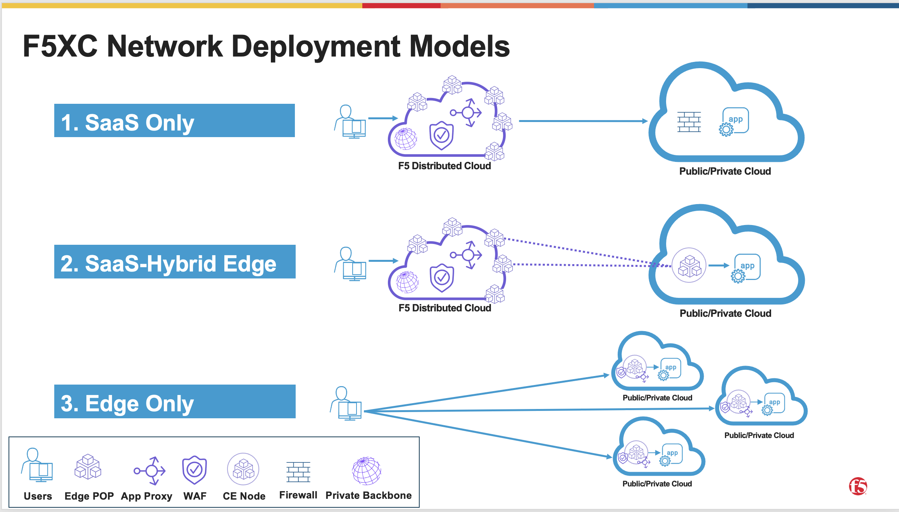
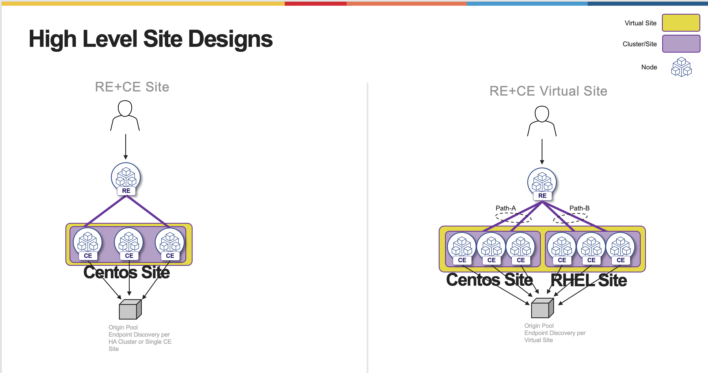

.. meta::
   :description: F5 Distributed Cloud Customer Edge Centos to RHEL OS Conversion Example
   :keywords: F5, Distributed Cloud, Customer Edge, Centos, RHEL, 
   :category: Field-Sourced-Content
   :sub-category: how-to
   :author: Michael Coleman
   
.. _ce_os_migration-centos_to_rhel:

Distributed Cloud Customer Edge Centos to RHEL OS Migration
==========================================================================

This repo will provide a solution to introduce a process to migrate a Customer Edge site from
End of Life Centos OS to RHEL Operating System.

Introduction
------------
Back in December 2023 Distributed Cloud Customer Edges image was based on Red Hat Enterprise Linux or RHEL Operating System  
Prior to that the Customer Edge ran on Centos 7.x Operating System which has been announced End of Life .
The goal of this guide is to provide a migration strategy from Centos to RHEL OS for customer edge sites that are in a SaaS-Hybrid Edge Deployment
pattern (option #2 in image below) where the VIP is on the Regional Edge and the tunnel termination and SNAT are on the customer edge.  
While we are using this deployment pattern as an example the concepts for other patterns are the same with a few caveats which will be included 
at the end of this article.

High Level Concepts
-------------------
Before we discuss the migration phases I want to introduce a few concepts that we will be utilizing.  The first concept is what we call a Virtual Site.  
A virtual Site provides us the ability to perform a given configuration on set (or group) of Sites.  The second term is Origin Pool.  
An origin pool is a mechanism to configure a set of endpoints grouped together into a resource pool used in the load balancer configuration.

The typical CE Site deployment consists of a HA cluster that discovers endpoints via a origin pool picked via the CE Site.
This discovery is typically via Private DNS or RFC-1918 IP ranges all though other methods are available.  
When we introduce the virtual site construct we will perform this discovery via a "Virtual Site" and not the original "CE Site".
As depicted below on the right hand side of the drawing you will see the origin pool is now discovered from all 6 nodes in the virtual site 
and will route traffic to the endpoint per the LB algorithm.  

Also the Virtual Site construct can be utilized for more advanced HA design scenarios and even for additional bandwidth between RE and CE, but this will be discussed in other articles.

Virtual Site Setup
------------------
A prerequisite to creating a virtual site for this conversion we would need 2 Customer Edge sites (one centos and the other rhel) that have network access to the origin pools one discovering the endpoints.
First we start to setup the virtual site construct by logging into our Distributed Cloud tenant.  
Once logged in:
   * Navigate to "Shared Configuration"
   * Under "Manage" chose "Virtual Site"
   * Add Virtual Site
   .. figure:: ./images/add-virt-site.png
    :align: center
   * Provide a Name, Description, Site Type being Used “CE”, and Site Reg Expression
   .. figure:: ./images/create-reg-expression.png
    :align: center
   * My example is key:value is (netta-as-vsite in true)
   * Next we will Add Virtual Site Label to Existing CE Cluster Sites (centos and rhel)
   * Go to Multi-Cloud Network Connect
   * Go to site management ("Site Management" will depend on how you deployed the site initally.  it could be a Generic Site, Cloud Deployment site, or Secure Mesh Site) once in the correct management object click on the 3 ellipses at the right and go to Manage Configuration.
   .. figure:: ./images/manage-site.png
    :align: center
   * Right hand corner Edit Configuration
   .. figure:: ./images/edit-config.png
    :align: center
   * Add virtual Site Label
   .. figure:: ./images/add-label.png
    :align: center 
   * Type in the Key from “Site Selector Expression” my example is ”netta-az-vsite” and click Assign a Custom Key (netta-az-vsite)
   .. figure:: ./images/add-key.png
    :align: center
   * Type in Value from “Site Selector Expression” my example is ”true” and click Assign a Custom Value (true)
   .. figure:: ./images/add-value.png
    :align: center

Proceed with these steps for all sites that will become members of this virtual site.

Virtual Site Origin Pool Configuration and Validation of Virtual Site Endpoint Discovery
-------------------
Now that we have our virtual site configured we need to configure the origin pool and perform discovery of the endpoints from the virtual site.

   * Navigate to "Multi-Cloud Application Connect" title
   * Go to Manage- Load Balancers- Origin pools
   .. figure:: ./images/origin-pool-config.png
    :align: center
   * In origin pool configuration choose the discovery method (typically IP or DNS but other options are available) of Origin on given sites

   * Under Site or Virtual Site choose Virtual Site and pick your virtual site from drop down menu (my example is the key of the regular expression we created earlier "netta-az-vsite")
   .. figure:: ./images/vsite-selection.png
    :align: center

   * Rest of origin pool config should be the same as the existing non virtual site origin pool

Validation
----------
In this step we will validate the origin pool is healthy from the virtual site.
   * Go to HTTP LB Performance
   * Click on Origins Servers and you should see 2 origins one form each site making up the virtual site (my examples are netta-vsiteclus1 and nettavsiteclus2)
   .. figure:: ./images/origin-healthy.png
    :align: center

Migration
---------
Now that we have the virtual site and the proper origin pool discovery method built we can start the migration.

   * Go to the HTTP LB and add the additional virtual site origin pool under the Origins section
   * Leverage weights and Priorities with the 2 origin pools to start the migration from the Centos Site to the Virtual site origin pool.  Typical starting point is both origin pools will have a Priority of 1 and Weight will be in a value to equal 100.  SO Centos origin pool have a weight of 95 and Virtual Site Origin Pool 5 and decrement and increment both as you migrate.
   * Once 100% of traffic is on the Virtual site origin pool remove the Virtual Site label from the centos site
   * Remove the original Centos Site origin pool form the HTTP LB
   * Delete the Centos Cluster

Additional Information
----------------------
In the above example for the Customer Edge (CE) deployment we were leveraging the RE's to publish VIPs to the internet 
and the CE's were used as tunnel termination points as well as SNAT to origin members.
If you move the VIP to the CE there are a few caveats with the way to advertise that VIP to the network.  
For example in order to leverage all nodes within the cluster you will need to provide a VIP Advertisement policy that consisted of an out of band DNS LB option or nested LB option.

Also as mentioned earlier in this article there can also be HA and bandwidth advantages to leveraging virtual sites as depicted below in the last slide.

   .. figure:: ./images/add-info.png
    :align: center

For more info on the migration process or CE design options reach out to your F5 Distributed Cloud Specialists

