.. meta::
   :description: F5 BIG-IP to Distributed Cloud Conversion Guide and Tips
   :keywords: BIG-IP, Conversion, Distributed Cloud, WAAP, API, Proxy Protocol
   :category: Field-Sourced-Content
   :sub-category: how-to
   :author: Michael Coleman

.. _conversion-guide:

BIG-IP To Distributed Cloud Conversion Frequently Asked Questions and Tips
==========================================================================

Disclaimer
~~~~~~~~~~

Please note that this FAQ document is intended as a general guide and is not exhaustive. 
While we strive to provide accurate and up-to-date information, the rapidly evolving nature of 
F5 Distributed Cloud means that specific details may change over time. Therefore, this guide 
should not be considered a substitute for professional advice or detailed consultation relevant 
to your specific circumstances.

Introduction
~~~~~~~~~~~~

This semi-comprehensive guide is designed to streamline your migration from F5 BIG-IP to F5 Distributed Cloud.  
This document aims to address frequently asked questions that arise during the migration process, offering clear, 
concise answers and practical insights to ensure a smooth transition.

Contributing
------------

Please feel free to submit issues or updates to the repo listed below.  

Github: https://github.com/f5devcentral/f5xc-solutions

Disqualifiers
-------------

This is a list of use-cases that can be used to immediately disqualify a migration, with some caveats. 
There are service chaining use-cases that could still work, or ways to implement policies to redirect 
traffic to a BIG-IP instead of XC, or ways to inline NGINX into XC to carry out many of the same effects.

#. Access services that require Match Across.  https://my.f5.com/manage/s/article/K5837

   * DTLS - SSLVPN
   * PCOIP - (HTML5 BLAST works fine)

   .. note:: Most VPN Providers allow you to disable UDP/DTLS and force TCP, this works fine.

#. NTLM

.. warning:: With the deprecation of NTLM Announced by Microsoft, it is recommend that all customers move to Kerberos, if at all possible.

#. APM Authentication services are not supported in Distrubuted Cloud today.

.. note:: There are some workable use-cases around Federated Authentication and proxy/service chaining.

Tools
-----

The following are tools available to use today.  It's important to note that none of these tools are 100%. It is highly recommended to work with an XC Specialist to help in migration from other platforms to XC.

.. _iHealth: https://ihealth2.f5.com/
.. _VS Code Extension: https://marketplace.visualstudio.com/items?itemName=F5DevCentral.vscode-f5
.. _Policy Supervisor: https://policysupervisor.io/
.. _BIND to XC Conversion tool: https://github.com/Mikej81/BINDtoXCDNS
.. _Domain Keep-Alive Analyzer: https://keepalive.f5-sa.myedgedemo.com/

- iHealth: `iHealth <iHealth_>`_
- VS Code Extension: `VS Code Extension <VS Code Extension_>`_
  - `VS Code Extension Diagnostics <VS Code Extension_>`_
- Policy Supervisor: `Policy Supervisor <Policy Supervisor_>`_
- BIND to XC Conversion tool: `BIND to XC Conversion tool <BIND to XC Conversion tool_>`_
- Domain Keep-Alive Analyzer: `Domain Keep-Alive Analyzer <Domain Keep-Alive Analyzer_>`_

Cloud & Platform Support
------------------------

- **Azure**: Azure is supported out of the box for Console and Terraform based deployments.

  * How To: https://docs.cloud.f5.com/docs/how-to/site-management/create-azure-site
|
- **AWS**: AWS is supported out of the box for Console and Terraform based deployments.

  * VPC: https://docs.cloud.f5.com/docs/how-to/site-management/create-aws-site
  * TGW: https://docs.cloud.f5.com/docs/how-to/site-management/create-aws-site-with-tgw
|
- **GCP**: GCP is supported out of the box for Console and Terraform based deployments.

  * How To: https://docs.cloud.f5.com/docs/how-to/site-management/create-gcp-site
|
- **OCI**: (Follow Baremetal, use qcow2 image):

  * Image: https://docs.cloud.f5.com/docs/images/node-cert-hw-kvm-images 
  * How To: https://docs.cloud.f5.com/docs/how-to/site-management/create-baremetal-site  
|
- **VMWare**: VMWare is supported out of the box Manual and Terraform based deployments.

  * Image: https://docs.cloud.f5.com/docs/images/node-vmware-images
  * How To: https://docs.cloud.f5.com/docs/how-to/site-management/create-vmw-site
|
- **Red Hat OpenShift**: OCP is supported out of the box Manual deployments.

  * How To - k8s: https://docs.cloud.f5.com/docs/integrations/integrating-cloud-mesh-with-ocp
  * How To - kubevirt: working...
|
- **ProxMox**: ProxMox is supported out of the box Manual and Terraform based deployments.

  * How To - Manual: :ref:`manual-proxmox-deployment`.
  * How To - Terraform: https://github.com/mwiget/f5xc-proxmox-site 
|
- **KVM**: KVM is supported out of the box Manual and Terraform based deployments.

  * Image: https://docs.cloud.f5.com/docs/images/node-cert-hw-kvm-images
  * How To: https://docs.cloud.f5.com/docs/how-to/site-management/create-kvm-libvirt-site
|
- **KubeVirt**: KubeVirt KVM is supported out of the box Manual, but documentation is under development.
|
- **Kubernetes**: k8s is supported out of the box Manual deployment via helm or manifest.

  * How To: https://docs.cloud.f5.com/docs/how-to/site-management/create-k8s-site
|
- **Baremetal**: Baremetal is supported out of the box Manual deployment.

  * Image: https://docs.cloud.f5.com/docs/images/node-cert-hw-kvm-images 
  * How To: https://docs.cloud.f5.com/docs/how-to/site-management/create-baremetal-site

AWAF to WAAP
------------

.. note:: While we understand that some organizations have spend years, and even decades tuning a WAF policy, the recommended best practice when moving to Distributed Cloud WAAP is to start with the default recommendations, and tune from there.
   Service Policies will cover traditional IP blocks as well as additional IP-Geo, and additional allow/deny rules.  

Web Application Firewalls (WAF) originally emerged to protect web applications by filtering and monitoring HTTP traffic between a web application and the Internet. WAFs primarily focus on defending against common web attacks such as SQL injection, cross-site scripting (XSS), and file inclusion, operating according to a set of predefined or customizable rules.

The evolution to Web Application and API Protection (WAAP) represents a shift towards a more comprehensive security framework that not only includes all the traditional protections offered by WAFs but also extends coverage to APIs, which are increasingly used as the backbone of modern applications.

Be sure to evaluate ASM Logs for WAF activity to determing which, if any policies need to be migrated.

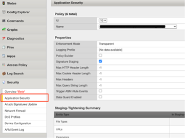

Check ASM Logs for activity. 

The best way to streamline the AWAF to XC WAAP policy is to use Policy Supervisor.

Bot Defense 
----------------------

Bot Defense is likely to require XC Bot Defense Standard at a minimum, or Advanced. XC WAAP contains only Bot Signatures. A simple alternative could be XC JavaScript Challenge, which might not meet your security requirements.

Policy Supervisor 
-----------------

Policy Supervisor can be used to convert BIG-IP Adv. WAF policies to XC WAF policies. 

If you do not have access to Policy Supervisor, you should check out the guidance here:  

 - https://f5.sharepoint.com/sites/salesandmktg/sales/SecurityMarketing 
 - https://github.com/f5devcentral/ps-convert  
 - https://policysupervisor.io/  
 - https://policysupervisor.io/convert  

 .. image:: ./images/picture18.png
   :width: 700px
   :align: center

Local Traffic Manager
---------------------

There are very few disqualifiers for LTM.

#. Load Balancing services that require Match Across.

   * DTLS
   * PCOIP

#. Streaming Profiles. We do not support streaming content today in XC LBs.

   * E.g., Rewriting HTML page content.

#. OneConnect

DNS
---

Distributed Cloud DNS supports Primary, Secondary, and DNS Load Balancing.  The base format for zones is JSON/YAML, and in some cases cannot be directly imported.

For BIG-IP DNS Wide IP configurations, there is not an automated way to migrate today, so this will be a manual process.

BIG-IP DNS Pool to XC DNS LB Pool
^^^^^^^^^^^^^^^^^^^^^^^^^^^^^^^^^

This will be a very small example of a manual migration to XC.  As we can see below from the output of ```list gtm pool``` we have two pools with single members.

.. code::

   gtm pool a pool1 {
       members {
           BIG-IPVE16-A.local:/Common/vip1 {
               member-order 0
           }
       }
   }
   gtm pool a pool2 {
       members {
           BIG-IPVE16-A.local:/Common/vip2 {
               member-order 0
           }
       }
   }

We can see how pool1 would map to XC DNS LB Pool in the figure below.

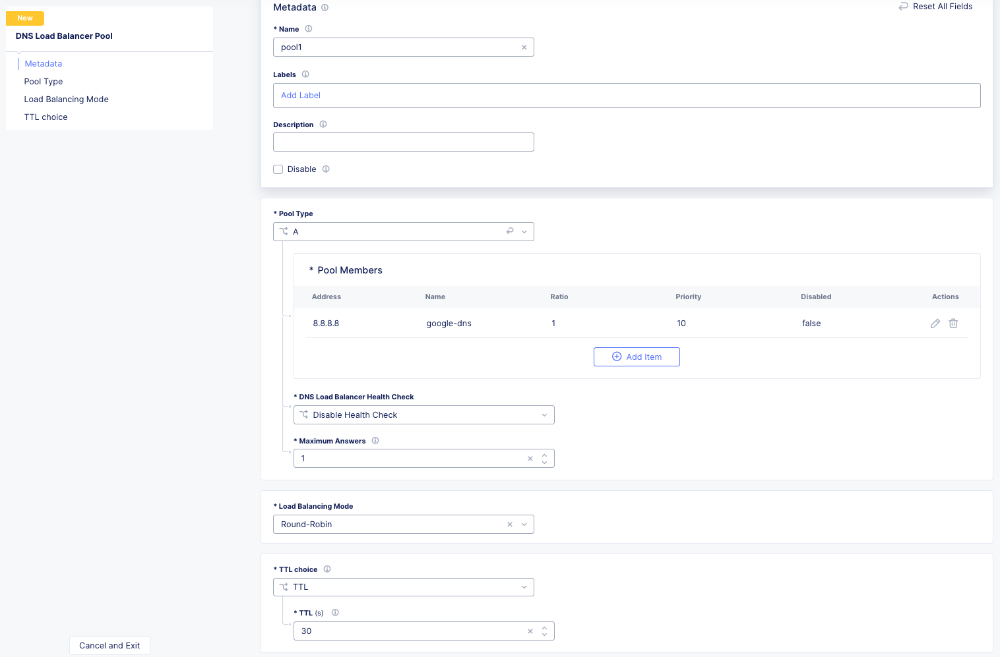

BIG-IP DNS Wide IP to XC DNS LB Record
^^^^^^^^^^^^^^^^^^^^^^^^^^^^^^^^^^^^^^

As we can see below from the output of ```list gtm wideip``` we have one Wide-IP with two pools.  There arent any rules here to dig in to, but those can be configured in XC as needed.

.. code::

   gtm wideip a example.domain.com {
       pools {
           pool1 {
               order 0
           }
           pool2 {
               order 1
           }
       }
   }

We can see how the Wide-IP for example.domain.com would map to XC in the figure below.

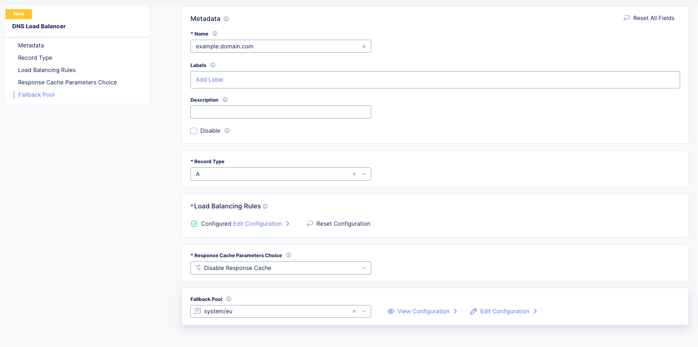

Zonerunner & DNSExpress
^^^^^^^^^^^^^^^^^^^^^^^

For BIG-IP DNS Host Zones, it is possible to migrate a couple ways.

* The named files which can be imported into F5 Distributed Cloud DNS.

  * You can follow instructions Here:  https://my.f5.com/manage/s/article/K000132496

* If you plan to maintain the BIG-IP DNS as Primary, and use Distributed Cloud as Secondary, AXFR is supported.

  * You can follow instructions here:  https://f5cloud.zendesk.com/hc/en-us/articles/7980850576535-How-to-set-up-F5-Distributed-Cloud-DNS-as-Secondary-for-BIG-IP-DNS-GTM

.. note:: Since this document is focused on BIG-IP to Distributed Cloud, BIND import is out of scope, but importing named/BIND9 zone files is also supported.

APM to Distributed Cloud (Service Chaining)
-------------------------------------------

We covered the disqualifiers, but there are some that will work fine, like service chaining for Federation, or header validation.

API Security
^^^^^^^^^^^^

One of the major differences in API security between BIG-IP and Distributed Cloud is the addition of API Discovery.  Today, the policies from BIG-IP will not transfer.  However,
if the current implemention utilized an OpenAPI Spec, that spec can be imported into Distributed Cloud.

One note for API Validation in Distributed Cloud is that the current "fall through" options (when a request does not match a defined path in the open api spec file used for 
validation), do not include a block option, only allow or custom to define specific blocked endpoints.

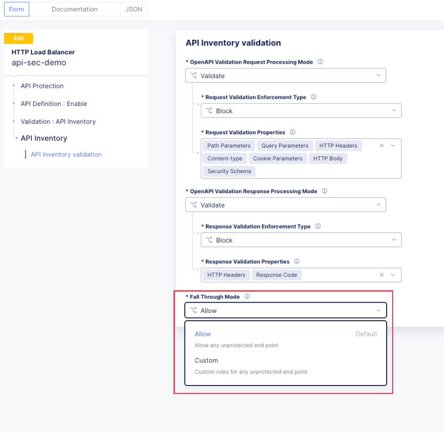

This does not mean that a positive security model based on the spec file can't be used, but some additional configuration is required. Presuming the spec file for the API
is uploaded to Distributed Cloud, we can leverage the automatically created API groups with a Service Policy to create a positive security model.

In Home > Web App & API Protection > [namespace] > Manage > API Management > API Definition the spec file is divided into two groups:
 #. ...shared-all-operations
 #. ...shared-base-urls

The first group can be referenced in a Service Policy (https://docs.cloud.f5.com/docs/how-to/app-security/service-policy) as the match criteria to allow requests through. In 
Home > Web App & API Protection > [namespace] > Manage > Service Policies > Service Policies create a new policy with a "Custom Rule List" and click configure:

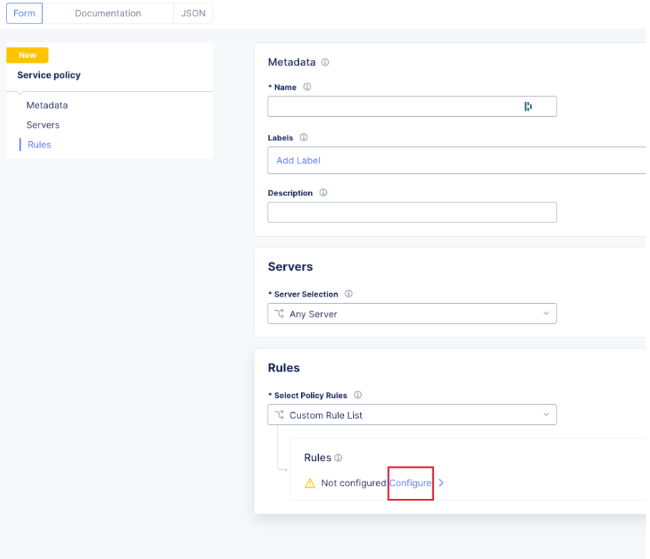

In the next dialog, click "Add Item" to begin configuring the allow criteria rule. One rule will be created for the API Group, other rules for paths not in the spec (if required), and a deny all rule.
For the first rule, give it a name and set "Action" to Allow. Then in the "API Group Matcher" area, click "configure" as such:

.. figure:: ./images/configure_api_matcher_allow.png
   :width: 900px
   :align: center

Select the ves-io-api-def-[APP NAME]-shared-all-operations group learned from the api definition file for that api and then click apply.

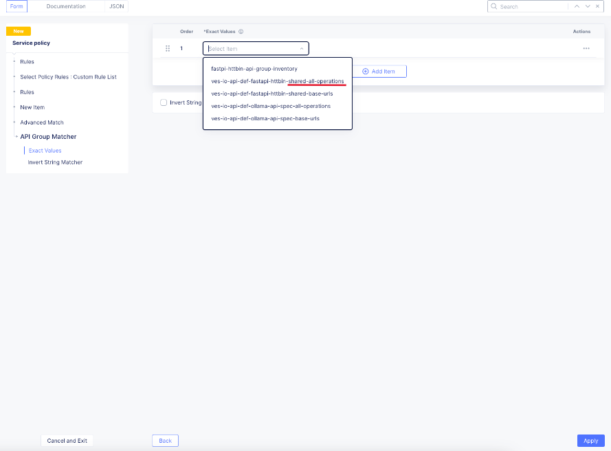

Back in the rule dialog, click apply to go back to the rule list dialog. Click add item for the next rule. HTTP paths can be added if neccessary with an "allow" action defined at the top:

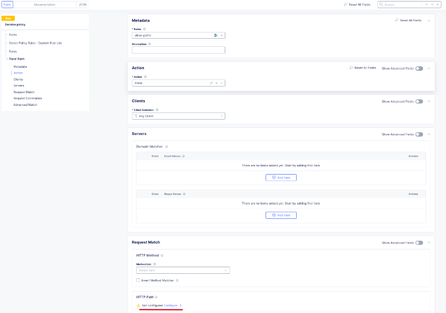

This can include explicit paths, path prefixes, regex paths, or combinations.

Finally, an explicit deny-all rule at the end of the rule list makes this a positive security model. Leave the match criteria as their defaults:

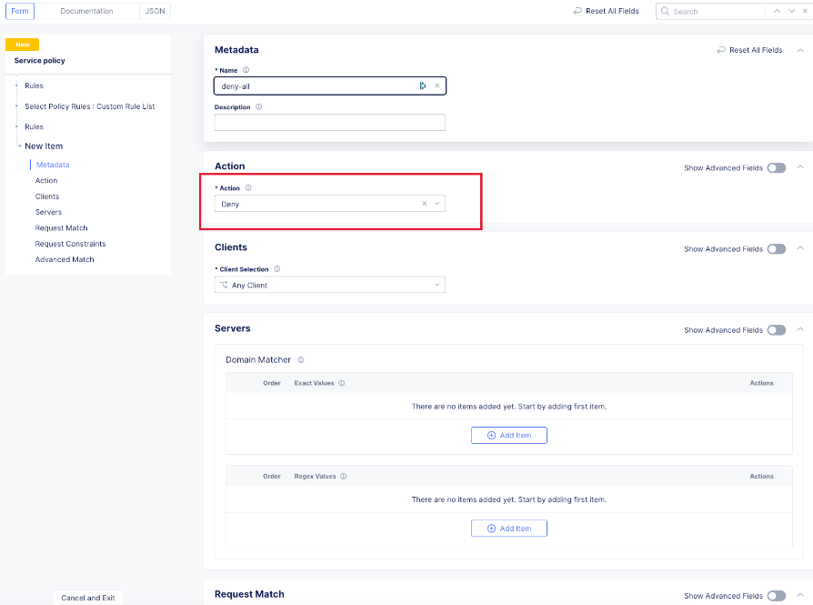

The final rule list should have the api matcher rule and http uri path rule above the deny-all rull:

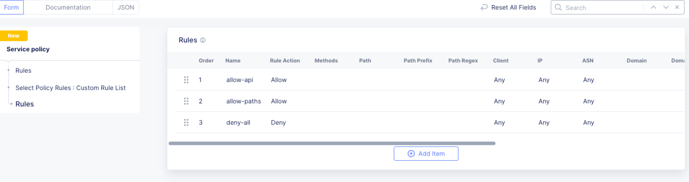

Click the apply button to return to the main Service Policy dialog and provide a name and click the Save and Exit Button. After the Service Policy is created it can be added
to the HTTP Load Balancer in the Common Security Controls section. Go to Home > Web App & API Protection > NAMESPACE > Manage > Load Balancers, select the triple dots under Actions, 
and click Manage Configuration. In the following dialog click Edit Configuration in the top right corner. Scroll to Common Security Controls and select the "Apply Specified Service 
Policies" option and click "Edit Configuration." 

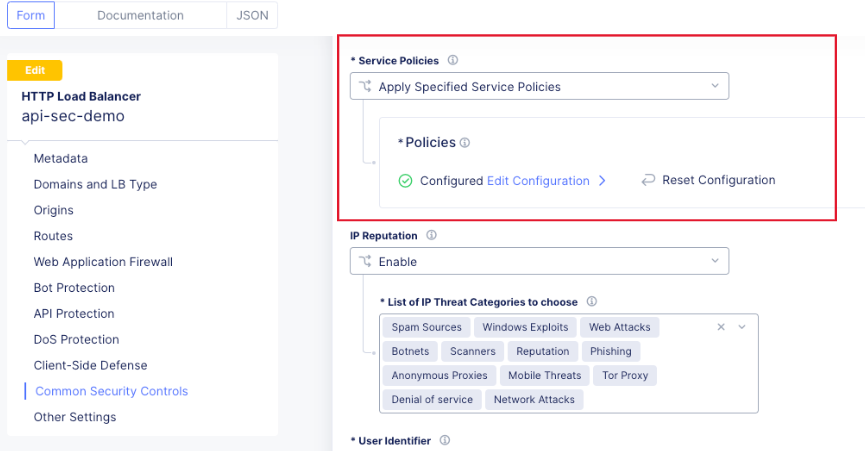

In the next dialog select the Service Policy created above and click apply. Then Save and Exit the HTTP Load Balancer config dialog.

Here is an example of a Security Policy configuration in JSON.

.. code::

   {
   "metadata": {
      "name": "positive-security-api-sample",
      "namespace": "[NAMESPACE]",
      "labels": {},
      "annotations": {},
      "disable": false
   },
   "spec": {
      "algo": "FIRST_MATCH",
      "any_server": {},
      "rule_list": {
         "rules": [
         {
            "metadata": {
               "name": "allow-api",
               "disable": false
            },
            "spec": {
               "action": "ALLOW",
               "any_client": {},
               "label_matcher": {
               "keys": []
               },
               "headers": [],
               "query_params": [],
               "http_method": {
               "methods": [],
               "invert_matcher": false
               },
               "any_ip": {},
               "any_asn": {},
               "api_group_matcher": {
               "match": [
                  "ves-io-api-def-[OAS-DEFINITION-NAME]-shared-all-operations"
               ],
               "invert_matcher": false
               },
               "additional_api_group_matchers": [],
               "body_matcher": {
               "exact_values": [],
               "regex_values": [],
               "transformers": []
               },
               "arg_matchers": [],
               "cookie_matchers": [],
               "waf_action": {
               "none": {}
               },
               "domain_matcher": {
               "exact_values": [],
               "regex_values": [],
               "transformers": []
               },
               "rate_limiter": [],
               "forwarding_class": [],
               "scheme": [],
               "challenge_action": "DEFAULT_CHALLENGE",
               "bot_action": {
               "none": {}
               },
               "mum_action": {
               "default": {}
               },
               "user_identity_matcher": {
               "exact_values": [],
               "regex_values": []
               },
               "segment_policy": {
               "src_any": {}
               },
               "origin_server_subsets_action": {},
               "jwt_claims": []
            }
         },
         {
            "metadata": {
               "name": "allow-paths",
               "disable": false
            },
            "spec": {
               "action": "ALLOW",
               "any_client": {},
               "label_matcher": {
               "keys": []
               },
               "headers": [],
               "query_params": [],
               "http_method": {
               "methods": [],
               "invert_matcher": false
               },
               "any_ip": {},
               "any_asn": {},
               "additional_api_group_matchers": [],
               "body_matcher": {
               "exact_values": [],
               "regex_values": [],
               "transformers": []
               },
               "arg_matchers": [],
               "cookie_matchers": [],
               "waf_action": {
               "none": {}
               },
               "domain_matcher": {
               "exact_values": [],
               "regex_values": [],
               "transformers": []
               },
               "rate_limiter": [],
               "forwarding_class": [],
               "scheme": [],
               "challenge_action": "DEFAULT_CHALLENGE",
               "bot_action": {
               "none": {}
               },
               "mum_action": {
               "default": {}
               },
               "user_identity_matcher": {
               "exact_values": [],
               "regex_values": []
               },
               "segment_policy": {
               "src_any": {}
               },
               "origin_server_subsets_action": {},
               "jwt_claims": []
            }
         },
         {
            "metadata": {
               "name": "deny-all",
               "disable": false
            },
            "spec": {
               "action": "DENY",
               "any_client": {},
               "label_matcher": {
               "keys": []
               },
               "headers": [],
               "query_params": [],
               "http_method": {
               "methods": [],
               "invert_matcher": false
               },
               "any_ip": {},
               "any_asn": {},
               "additional_api_group_matchers": [],
               "body_matcher": {
               "exact_values": [],
               "regex_values": [],
               "transformers": []
               },
               "arg_matchers": [],
               "cookie_matchers": [],
               "waf_action": {
               "none": {}
               },
               "domain_matcher": {
               "exact_values": [],
               "regex_values": [],
               "transformers": []
               },
               "rate_limiter": [],
               "forwarding_class": [],
               "scheme": [],
               "challenge_action": "DEFAULT_CHALLENGE",
               "bot_action": {
               "none": {}
               },
               "mum_action": {
               "default": {}
               },
               "user_identity_matcher": {
               "exact_values": [],
               "regex_values": []
               },
               "segment_policy": {
               "src_any": {}
               },
               "origin_server_subsets_action": {},
               "jwt_claims": []
            }
         }
         ]
      }
   }
   }

LTM to Load Balancing as a Service
----------------------------------

Most services will move to Distributed Cloud fairly easily.

TCP Option 28 and Proxy Protocol
^^^^^^^^^^^^^^^^^^^^^^^^^^^^^^^^

While the BIG-IP supports TCP Option 28 to maintain client source ip, due to never making it out of experimental, Distributed cloud went with Proxy Protocol.  This can
be configured under Distributed Cloud Origin Pool Settings.

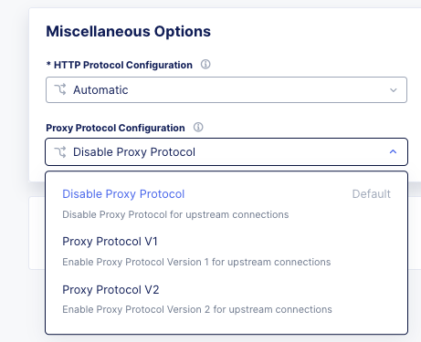

   Origin Pool Miscellaneous Config.

TCP Passthrough Load Balancer
^^^^^^^^^^^^^^^^^^^^^^^^^^^^^

To create a load balancer for TLS passthrough, ensure that you do not configure TLS on the Load Balancer, or the Origin Pool.  You can still use SNI on the Load Balancer.

.. figure:: ./images/passthrough1.png
   :width: 700px
   :align: center

   TLS Passthrough Load Balancer Config

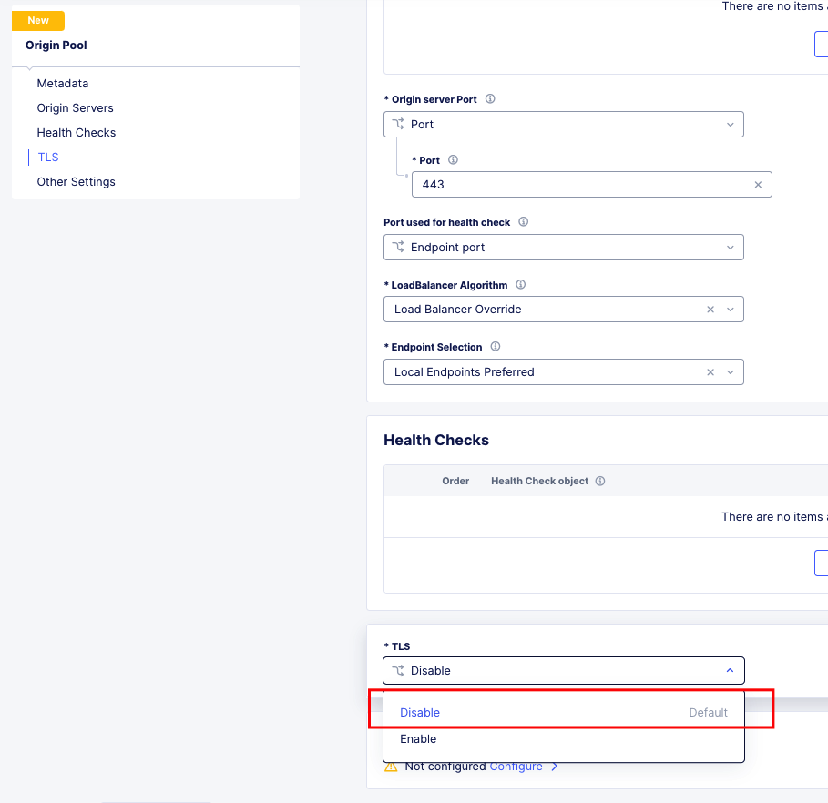

   TLS Passthrough Origin Pool Config

Websockets
^^^^^^^^^^

Websockets are supported for load balancing in Distributed Cloud.  

https://f5cloud.zendesk.com/hc/en-us/articles/18944650914327-How-to-configure-Websockets-correctly-on-F5-XC-platform

Custom Error & Response pages
^^^^^^^^^^^^^^^^^^^^^^^^^^^^^

There are several options in Distributed Cloud for Custom Error and Response Pages.

* https://f5cloud.zendesk.com/hc/en-us/articles/12660970533527-What-is-the-Custom-Error-Response-feature

There may be instances where more details are desired for the response page.  Today, the only value that can be insert via the custom response is Request ID ``{{req_id}}``.  
However, it is possible to use javascript in the response page to add additional details from the request / response headers.

.. code-block:: html

   <!DOCTYPE html>
   <html lang="en">
   <head>
       <meta charset="UTF-8">
       <meta name="viewport" content="width=device-width, initial-scale=1.0">
       <title>Request Rejected</title>
   </head>
   <body>
   </body>
   <script>
   var req = new XMLHttpRequest();
   req.open('GET', document.location, true);
   req.send(null);
   req.onload = function() {
     var headers = req.getResponseHeader("client-ip").toLowerCase();
     document.body.innerText = `Value of 'client-ip' header: ${headers}`;
     console.log(headers);
   };
   </script>
   </html> 

Another example is included below in the APM iRule Event section.

LTM as Upstream / Origin
^^^^^^^^^^^^^^^^^^^^^^^^

Occasionally there is a use-case where instead of a Customer Edge on-premises, you want to continue to use a BIG-IP.  This will work,
as long as proper preparations are made.  In many situations there may be custom (or even using default) TCP and HTTP Profiles which can be
problematic when moving to a SaaS based solution.

HTTP/1.1 & HTTP/2
^^^^^^^^^^^^^^^^^

BIG-IP by default uses HTTP/1.1 on profiles.  Distributed Cloud uses HTTP/2 by default.  It is important to ensure that the Origin Pool in XC is configured for HTTP/1.1 when the Upstream is a BIG-IP.

HTTP Keep-Alive & Connection Headers
^^^^^^^^^^^^^^^^^^^^^^^^^^^^^^^^^^^^

The Keep-Alive general header allows the sender to hint about how the connection may be used to set a timeout and a maximum amount of requests.

.. warning:: Connection-specific header fields such as Connection and Keep-Alive are prohibited in HTTP/2 and HTTP/3. Chrome and Firefox ignore them in HTTP/2 responses, but Safari conforms to the HTTP/2 specification requirements and does not load any response that contains them.

Since keep-alive and connection headers will be ignored, its important to evaluate timeouts from XC to BIG-IP and properly configure timeouts in the Load Balancer and Origin configurations.

Timeouts can be configured in a a number of locations in the XC Console.  

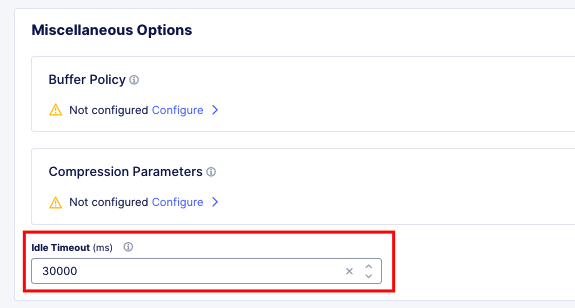

   Load Balancer Timeout.
   
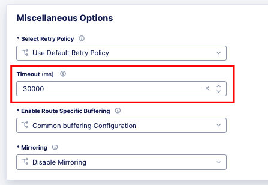

   Route Timeout.

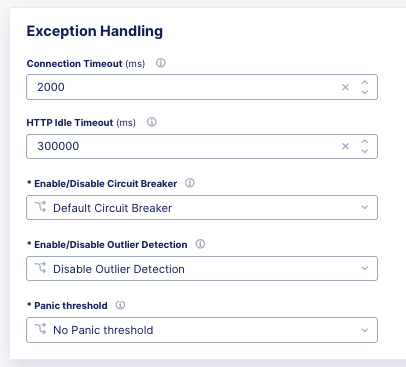

   Origin Timeout.

Monitors to Health Checks
^^^^^^^^^^^^^^^^^^^^^^^^^

If the Upstream (Origin Server) is still using HTTP/1.1 or is a BIG-IP using HTTP/1.1, then it may be a good idea to include the previously 
mentioned Connection header. The Connection general header controls whether the network connection stays open after the current transaction finishes. 
If the value sent is keep-alive, the connection is persistent and not closed, allowing for subsequent requests to the same server to be done.
Since this is for a Monitor/Health Check, its a good practice to close the connection. An example of the JSON you can paste into XC is below.

.. code-block:: json
   
   {
   "metadata": {
      "name": "example",
      "disable": false
   },
   "spec": {
      "http_health_check": {
      "use_origin_server_name": {},
      "path": "/",
      "use_http2": false,
      "headers": {
         "Connection": "Close"
      },
      "expected_status_codes": [
         "200",
         "302"
      ]
      },
      "timeout": 3,
      "interval": 15,
      "unhealthy_threshold": 1,
      "healthy_threshold": 3,
      "jitter_percent": 30
      }
   }

This is just an example and should be modified for specific scenarios. 


SNAT
^^^^

Distributed Cloud is a SaaS Platform.  BIG-IP is not.  Some applications may be configured to accept client source for persistence or other purposes.  Since the traffic will be proxied, applications been to be enabled for a more modern approach.


Clone Pool to Mirroring
^^^^^^^^^^^^^^^^^^^^^^^

Many customers use either a clone pool config or an irule to clone/mirror traffic on BIG-IP.  This config is called mirroring on Distributed Cloud and can be configured within an HTTP LoadBalancer Route.

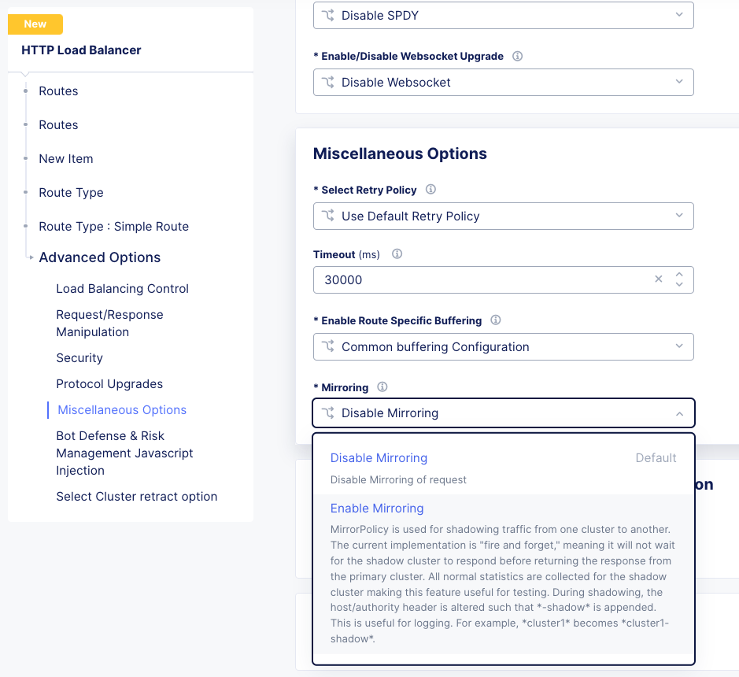

Mirroring is used for shadowing traffic from one cluster to another. The approach used is "fire and forget", meaning it will not wait for the shadow cluster to respond before returning the response from the primary cluster. All normal statistics are collected for the shadow cluster making this feature useful for testing and troubleshooting. During mirroring, the host/authority header is altered such that *-shadow* is appended.

LTM to Customer Edge
^^^^^^^^^^^^^^^^^^^^

The following ports can not be used when advertising services on a Customer Edge. 

.. list-table:: Reserved Ports
   :widths: 50 50
   :header-rows: 0

   * - 22
     - 53 **Check Note**
   * - 68
     - 323
   * - 500
     - 1067
   * - 2379
     - 2380
   * - 4500
     - 5355
   * - 6443
     - 8005
   * - 8007
     - 8087
   * - 8443
     - 8444
   * - 8505
     - 8507
   * - 9007
     - 9090
   * - 9153
     - 9999
   * - 10249
     - 10250
   * - 10251
     - 10252
   * - 10256
     - 10257
   * - 10259
     - 18091
   * - 18092
     - 18093
   * - 18095
     - 22222
   * - 23790
     - 23791
   * - 23801
     - 23802
   * - 28000 - 32767 (volterra)
     - 28000 - 32767 (kubernetes) 

.. note:: When using a Custom VIP/IP on the Customer Edge, is is possible to advertise / listen on TCP/UDP 53.

SNAT Pooling
^^^^^^^^^^^^

Today, XC does not support a traditional SNAT pool type configuration, however, you can scale SNAT based on nodes in a cluster.  So a 3 node cluster will have 3 IPs for SNATTING, if you need more SNAT IPs, then add more nodes. 

Traffig Group / Floating Self-IP
^^^^^^^^^^^^^^^^^^^^^^^^^^^^^^^^

To create the same scenario as a traffic group or floating self, you can use VRRP.  Check out Harmon's article here, where he discusses some of the CE design scenarios.  https://community.f5.com/t5/technical-articles/f5-distributed-cloud-customer-edge-site-deployment-amp-routing/ta-p/319435 

A byproduct of enabling VRRP on your cluster, and creating a common VIP, is that you can also use that common VIP as a default gateway. 

Refer to the Customer Edge section for additional details on VRRP and Multicast. `Clustering and High availability`_

Custom Monitors
^^^^^^^^^^^^^^^

If you have been relying on custom monitors for routine tasks such as backing up data to an FTP server, sending email reports, or generating alerts based on storage availability. With F5 Distributed Cloud (XC), many of these functions are seamlessly integrated, thanks to our SaaS platform’s built-in scheduled reporting and alert capabilities.

However, if you need to perform a specific task that isn't currently supported by XC, such as invoking an API or executing a specialized function, we've got you covered. You can easily recreate this functionality in a small container script (for example, using bash) and deploy it as a scheduled task within our virtual Kubernetes environment.

For instance, if you need to activate a service policy or a network firewall rule at particular times each day, you can set up a cron job in XC. This job will operate on your schedule and interact with the XC API to execute your policies as planned.

.. code-block:: yaml

   kind: CronJob
   apiVersion: batch/v1beta1
   metadata:
     name: coleman-generic-restcurl
     labels:
       app: restcurl
       type: cron
     annotations:
       ves.io/virtual-sites: m-coleman/coleman-ves-io-ny-re
   spec:
     schedule: "30 10,20 * * 1-5" # Every weekday at 10:30, and 20:30 UTC
     jobTemplate:
       metadata:
         labels:
           app: restcurl
           type: cron
       spec:
         template:
           metadata:
             annotations:
               ves.io/workload-flavor: tiny
               ves.io/virtual-sites: m-coleman/coleman-ves-io-ny-re
           spec:
             restartPolicy: Never
             containers:
               - name: curl-worker
                 image: curlimages/curl:latest
                 imagePullPolicy: IfNotPresent
                 env:
                   - name: API_URI
                     value: "http://<tenant>.console.ves.volterra.io/api/web/namespaces"
                   - name: API_TOKEN
                     value: "APIToken <token value>"
                   - name: API_METHOD
                     value: "POST"
                   - name: API_PAYLOAD
                     value: '{"metadata": {"name": "service-policy-1","namespace": "namespace"}, "spec": { "deny_all_requests": {} } }'
                 command:
                   - "/bin/sh"
                   - "-ec"
                   - |
                     set -o nounset
                     set -o errexit
                     echo "API Call"
                     curl -s -X ${API_METHOD} -H 'Content-Type: application/json' -H "Authorization: ${API_TOKEN}" "${API_URI}"

QKView - iHealth
----------------

Graphs
^^^^^^

SSL Transactions
^^^^^^^^^^^^^^^^

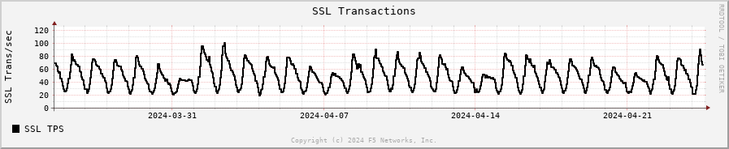

TMM Client-Side Throughput
^^^^^^^^^^^^^^^^^^^^^^^^^^

The sum throughput of all Traffic Management Microkernel (TMM) and Packet Velocity ASIC (PVA) traffic on the client side. The following fields are represented in bits per second and packets per second: 

 - Client In: The sum of all ingress traffic 

 - Client Out: The sum of all egress traffic 

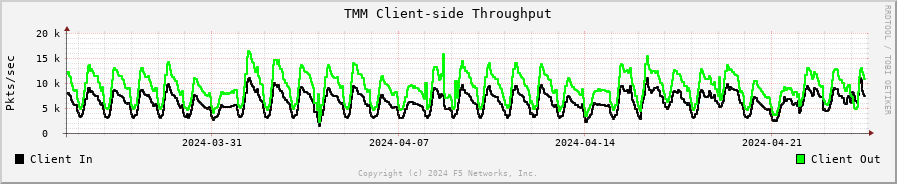

TMM Server-Side Throughput
^^^^^^^^^^^^^^^^^^^^^^^^^^

The sum throughput of all TMM and PVA traffic on the server side. The following fields are represented in bits per second and packets per second: 

 - Server In: The sum of all egress traffic 

 - Server Out: The sum of all ingress traffic 

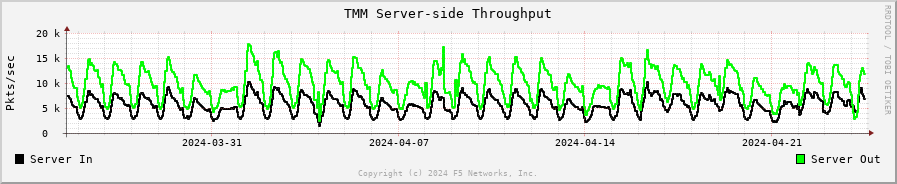

Throughput
^^^^^^^^^^

The total throughput in and out of the BIG-IP system collected from all interfaces, including traffic processed by all Traffic Management Microkernel (TMM) and Packet Velocity ASIC (PVA), except the management interface. The following fields are represented in bits per second and packets per second: 

 - In: The ingress traffic to the system through its interfaces 

 - Out: The egress traffic from the system through its interfaces 

 - Service: The larger of the two values of combined client and server-side ingress traffic or egress traffic, measured within TMM. You can compare this to VE-licensed bandwidth. 

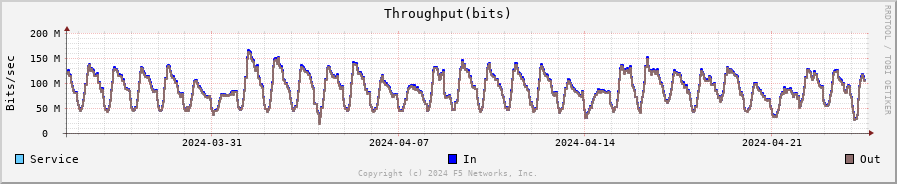

iRules
------

One of the first things to evaluate with irules, is if they are even being used. An effective way to gauge that is to check the Unused Objects under the Config Explorer. So, if you have 150 total irules, but are not using 102 of them, then that means we only need to review 48 irules, and based on historical evidence, I would estimate over 75% of those are just uncustomized redirect irules. 

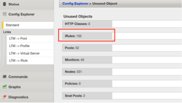

You can also see in the specific irules how many times its even executed (if its attached) under the irules Statistics. 

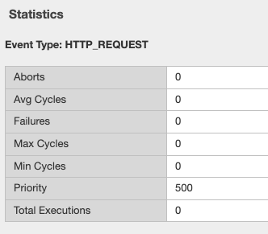

.. image:: ./images/picture8-a.png
   :width: 500px
   :align: center

Commands
--------

list /ltm virtual all-properties
^^^^^^^^^^^^^^^^^^^^^^^^^^^^^^^^

A straightforward way, other than reviewing the bigip.conf is to use the list /ltm virtual all-properties command and then search for “rules {”. 

IRules that can be ignored because it's a checkbox choice in XC are redirects: 

.. code-block:: text

   rules { 
        /Common/_sys_https_redirect 
   }

In the example QKView I am using, there are 670 instances of “rules”, and 468 instances of “/Common/_sys_https_redirect”. So, we have 202 instances of potential irules to evaluate, which is still pretty high.  But if we look at the irules, many customers have built custom redirects, which we can potentially ignore as well once we see they are just redirects. 

Let's look at an irule example, we can see it's in use, and has had 34k executions in the past 30 days. I'm sure someone will argue the point, but this is still a redirect irule. Or you could call it an apology page. It's setting the default pool, and if there aren't any active members, sending it to another page.  

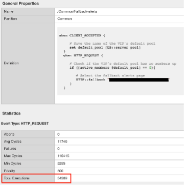

This is extremely easy to do with just L7 Routes, and custom error pages. 

In this qkview, there are mostly custom redirect irules based on host headers, over and over again.  This is a manual process, so be prepared to see a lot of redirects. 

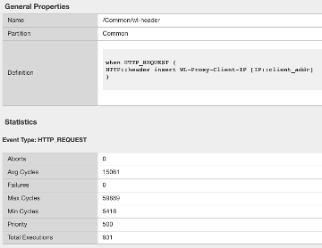

Then be prepared to see a ton of custom logging or header injections. Header Insert, Removal, and Appending can be easily done with the Load Balancer Advanced config, or more granularly via the L7 Route configs. 

In the case of this irule, it's just going to insert the header on every HTTP REQUEST. This is managed at the top-level Load Balancer Configs under More Options.

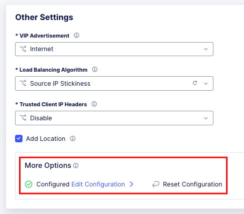

From there you can add and remove headers to your heart's content. 

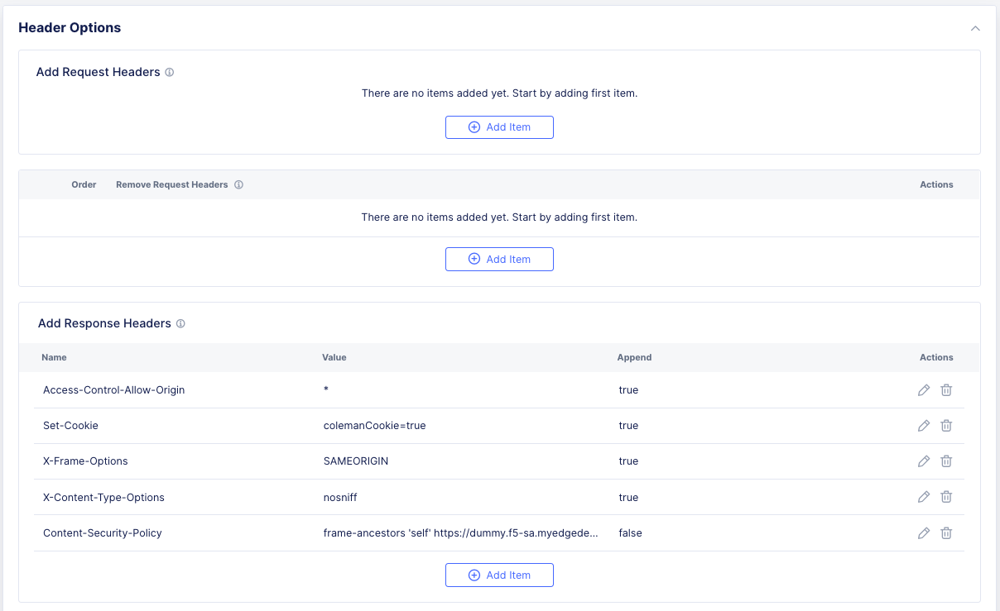

If this irule had more logic, IF host header = this.domain.com, then we would use the L7 Route options. 

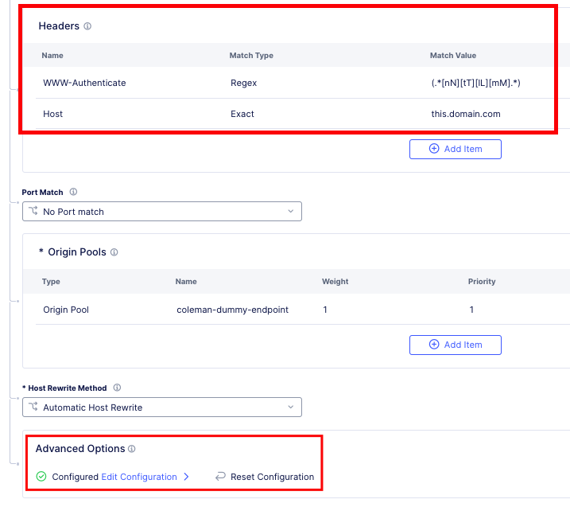

show /ltm profile http global
^^^^^^^^^^^^^^^^^^^^^^^^^^^^^

This command will give you a quick snapshot of traffic with a virtual server with an associated HTTP profile. 

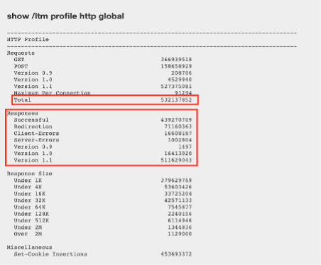

We can see that we have had about 532 million requests across all virtual servers (over the last 30 days in this example). We can also see that there were about 71 million redirects. 

This data is perfect if we are evaluating an API use-case. 

UNIX - TMOS - tmctl -a (blade)
------------------------------

This gets us to the TMSTATS collections that span usually beyond the last 30 days that the RRD Graphs might show. Scroll down to the profile_http link and click it. This will give the aggregate values as well as every individual virtual server with a HTTP profile in a table format with column headers that are clickable to sort the data based on the values. Within this you will also reveal where some dormant virtuals are that do not need to be considered for migrations. 

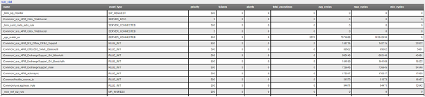

iRules
------

If not clear, any irules that are performing redirects, header additions, rewrites, or appending values are easily migrated to L7 Routes. If the irules requires things like binary scan, that is something XC does not support today. 

IRules that focus on Access Control based on evaluating IP blocks, client source addresses, etc., are easily migrated to Service Policies. 

RULE_INIT
^^^^^^^^^

RULE_INIT is generally used to set some static variables for use in the rest of the irule, since we don’t have any programming logic in XC in order to take advantage of this, it can generally be thrown out, but pay attention to any definitions of data groups or things like that so you can understand the irules purpose; is it pulling domain names, is it pulling client ips, etc. 

CLIENT_ACCEPTED
^^^^^^^^^^^^^^^

Depending on what is happening during CLIENT_ACCEPTED this event may not be needed, or if there is some complex action requirements it will not be a good possibility for porting. Most customers use this to log client ip/prefix data, or select a pool based on an identifying client attribute, this can be done via L7 Routes.

CLIENTSSL_CLIENTCERT
^^^^^^^^^^^^^^^^^^^^

This event is probably not as common outside of mTLS use-cases, and in many cases is just used for logging, but also commonly used to create SSL Session ID's for Persistence use-cases. While XC does not support SSL Session ID persistence today, it does support mTLS, and it can extract the X.509 attributes and inject into headers to use for similar purposes. 

If we evaluate the following example:  

.. code-block:: tcl

   when CLIENTSSL_CLIENTCERT {
      set cert [SSL::cert 0]
      # Save the cert fields to a list
      set fields [X509::cert_fields $cert [SSL::verify_result] hash issuer serial sigalg subject subpubkey validity versionnum whole]
      log local0. "Client certificate fields - $fields"
      # Add the cert to the session table for use in subsequent HTTP requests.  Use the SSL session ID as the key.
      session add ssl [SSL::sessionid] [list $cert $fields] $::session_timeout
   }

We can use mTLS configuration to extract the X.509 Values. 

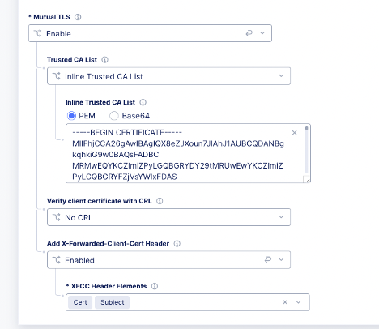

Which we can then use for logic in the L7 routes. 

LB_SELECTED & LB_FAILED 
^^^^^^^^^^^^^^^^^^^^^^^

Depending on the use-case here, it's possible that we can supply simple solutions in XC to match functionality. Are you sending an apology page, are you redirecting, etc. 

HTTP_REQUEST 
^^^^^^^^^^^^

Depending on what is happening here, most irules are easily portable to L7 routes, excluding any collection or streaming. Setting, removing, and appending HTTP Headers can be carried out in several ways, including AND/OR logic for modification.  

Matching Host Header and URI Path Example using L7 Route Configs:

.. code-block:: tcl

   when HTTP_REQUEST {
     if { ([string tolower [HTTP::host]] equals "domain.com") && [HTTP::uri] starts_with "/xyz" } {
       node 1.1.1.1 443
     }
   }

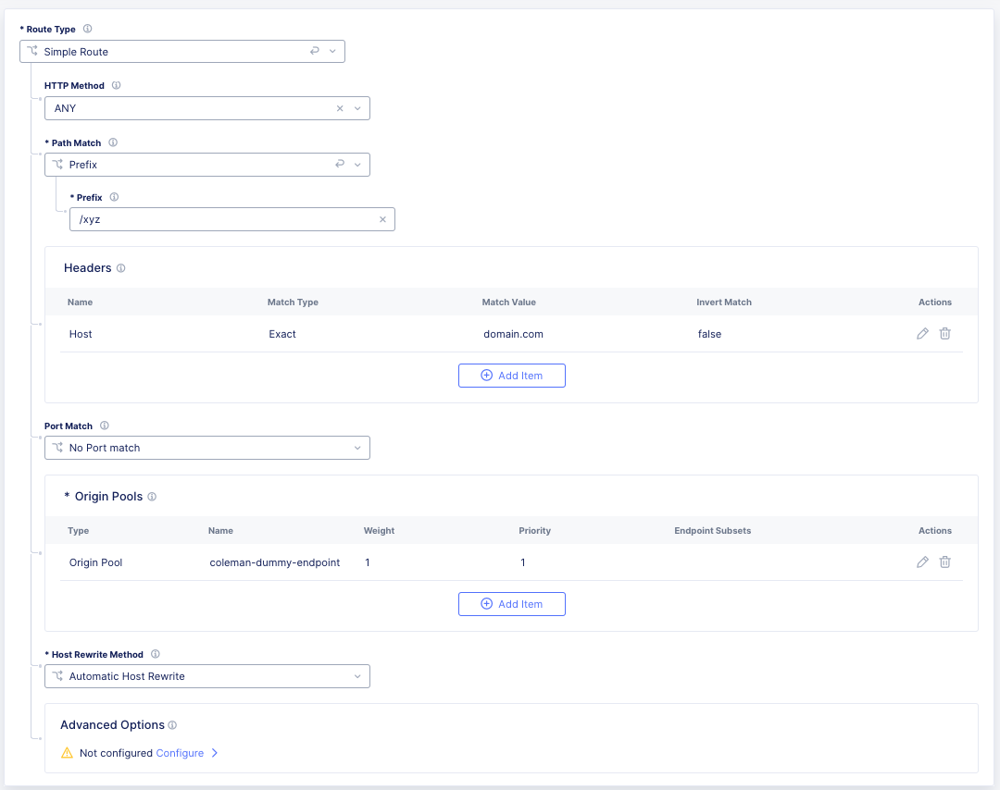

If the irule also does Host rewrites to the upstream, or path rewriting, this is also done with L7 Route configs.

.. code-block:: tcl

   when HTTP_REQUEST {
     if { ([string tolower [HTTP::host]] equals "domain.com") && [HTTP::uri] starts_with "/xyz" } {
       # Rewrite the host header
       HTTP::host "app1.domain.com"
       
       # Rewrite the URI path from /xyz to /lmn
       HTTP::uri [string map {"/xyz" "/lmn"} [HTTP::uri]]
   
       node 1.1.1.1 443
     }
   }

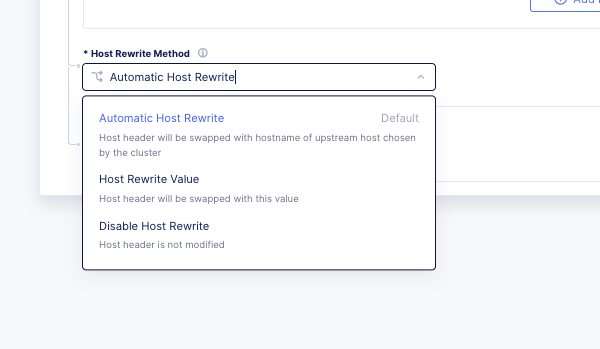

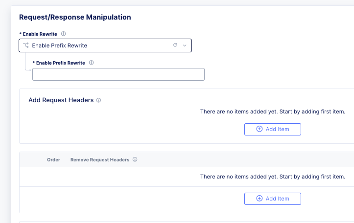


Another very common example, and maybe the first irule many learn, is to evaluate the file extention in the request, and redirect traffic to a CDN Cache or static file pool.


HTTP_REQUEST_DATA 
^^^^^^^^^^^^^^^^^

XC does not support HTTP Collect or streaming, so irules that rely heavily on this event will not be a good fit. However, you can do service chaining with NGINX in vk8s to carry out the end goal in some cases. 

HTTP_RESPONSE
^^^^^^^^^^^^^

Like HTTP_REQUEST, this should be easily portable to L7 routes in XC.  For example: 

.. code-block:: tcl

   when HTTP_RESPONSE { 
      HTTP::header insert Strict-Transport-Security "max-age= 31536000" 
      HTTP::header insert "X-FRAME-OPTIONS" "SAMEORIGIN" 
   } 

HTTP_RESPONSE_DATA 
^^^^^^^^^^^^^^^^^^

XC does not support HTTP Collect or streaming, so irules that rely heavily on this event will not be a good fit. However, you can do service chaining with NGINX in vk8s to carry out the end goal in some cases. 

ACCESS_SESSION_STARTED, ACCESS_POLICY_AGENT_EVENT, ACCESS_POLICY_COMPLETED, ACCESS_ACL_DENIED, ACCESS_ACL_ALLOWED, REWRITE_REQUEST_DONE, REWRITE_RESPONSE_DONE, ACCESS_SESSION_CLOSED 
^^^^^^^^^^^^^^^^^^^^^^^^^^^^^^^^^^^^^^^^^^^^^^^^^^^^^^^^^^^^^^^^^^^^^^^^^^^^^^^^^^^^^^^^^^^^^^^^^^^^^^^^^^^^^^^^^^^^^^^^^^^^^^^^^^^^^^^^^^^^^^^^^^^^^^^^^^^^^^^^^^^^^^^^^^^^^^^^^^^^^

Since these are all APM iRules events, they are not supported in XC.  What we can do is evaluate incoming headers; MRH_Session, www-authenticate, etc., and make decisions on traffic. 

An Example of filtering unauthenticated traffic would be to create a route and filter on Authorization Header exists, or 401 Error from Upstream, and then provide a custom error page:

In Distributed Cloud Console, I would adjust the Custom Error Response settings in the load balancer and use the code below.

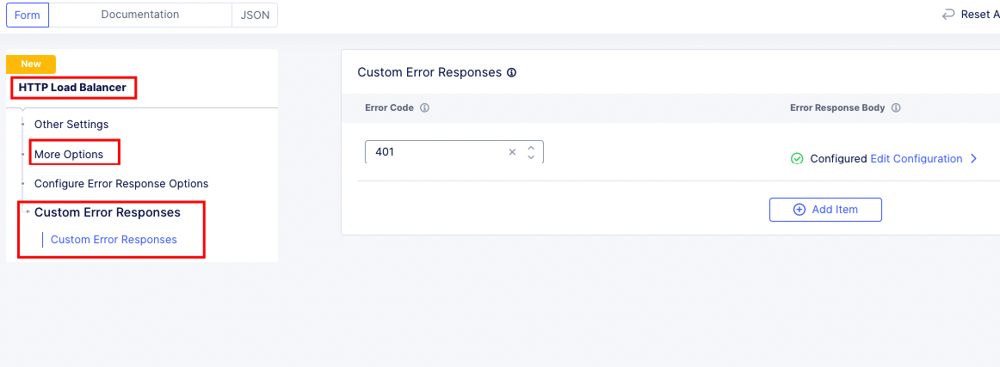

   Distributed Cloud Load Balancer Custom Error

.. code-block:: html

   <html>
   <head>
       <script src="https://cdn.jsdelivr.net/gh/dankogai/js-deflate/rawdeflate.js"></script>
   </head>
   
   <body>
       <h1>SAMLAuthnRequest Test</h1>
       <br />
       To use, modify the following variables:
       <ul>
           <li>var consumer = window.location.href; //Service Provider</li>
           <li>var destination = 'https://sso.domain.com/login'; //Identity Provider </li>
           <li>var issuer = 'https://sso.domain.com'; //Identity Provider</li>
       </ul>
       Todo:
       <ul>
           <li>-what else?</li>
       </ul>
   
       <form id="login" method="POST">
           <input type="hidden" id="SAMLRequest" name="SAMLRequest">
           <button onclick="setAssertion()">Logon</button>
   
           <script>
               var consumer = window.location.href;                //Service Provider
               var destination = 'https://sso.domain.com/login';   //Identity Provider
               var issuer = 'https://sso.domain.com';             //Identity Provider
               var template = `
           '<samlp:AuthnRequest xmlns:samlp="urn:oasis:names:tc:SAML:2.0:protocol" xmlns:saml="urn:oasis:names:tc:SAML:2.0:assertion" ID="" Version="2.0" ProviderName="XC SP" IssueInstant="2014-07-16T23:52:45Z" 
           Destination="${destination}" ProtocolBinding="urn:oasis:names:tc:SAML:2.0:bindings:HTTP-POST" 
           AssertionConsumerServiceURL="${consumer}">  
           <saml:Issuer>${issuer}</saml:Issuer>  
           <samlp:NameIDPolicy Format="urn:oasis:names:tc:SAML:1.1:nameid-format:emailAddress" AllowCreate="true" />  
           <samlp:RequestedAuthnContext Comparison="exact">
           <saml:AuthnContextClassRef>urn:oasis:names:tc:SAML:2.0:ac:classes:PasswordProtectedTransport</saml:AuthnContextClassRef>
           </samlp:RequestedAuthnContext>
           </samlp:AuthnRequest>'
           `;
               var deflatedTemplate = RawDeflate.deflate(template);
               //var encodedTemplate = btoa(template);
               var encodedTemplate = btoa(deflatedTemplate);
               function setAssertion() {
                   document.getElementById("SAMLRequest").setAttribute('value', encodedTemplate);
                   document.getElementById("login").setAttribute('action', issuer);
               }
   
           </script>
       </form>
   </body>
   
   </html>

Logging
^^^^^^^

Many customers use iRules to add more values to logs. With XC, many of the standard values are captured as part of the request and security logs by default.  

XC will automatically log telemetry data on platform, and can be connected to a SIEM via a Local (SYSLOG) or Global Log Reciever (JSON/HEC).  
https://docs.cloud.f5.com/docs/how-to/others/global-log-streaming

Let's look at an example that captures SSL Cipher and Version: 

.. code-block:: tcl

   when CLIENTSSL_HANDSHAKE { 
      # Identify the Client and negotiated cipher. 
      if {$static::payload_dbg}{log local0.debug "Connection from Client: [IP::client_addr] with Cipher: [SSL::cipher name] and SSL Version: [SSL::cipher version]"} 
   } 

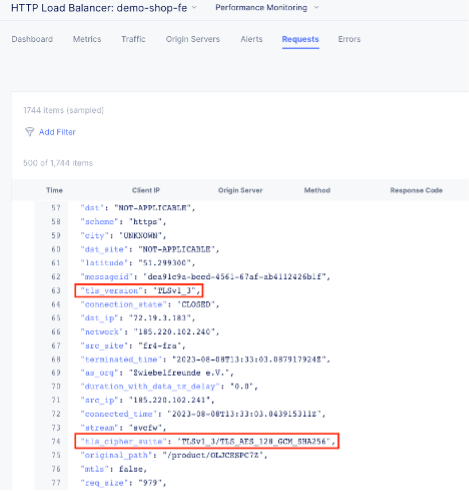

Another example that is common is logging all headers, which is another default in XC.  I have seen many variations of the following irule: 

.. code-block:: tcl

   when HTTP_REQUEST {  
      set LogString "Client [IP::client_addr]:[TCP::client_port] -> [HTTP::host][HTTP::uri]"  
      log local0. "REQUEST======================================"  
      log local0. "$LogString (request)"  
      foreach aHeader [HTTP::header names] {  
         log local0. "$aHeader: [HTTP::header value $aHeader]"  
      }

      log local0. "============================================="  
   }  

   when HTTP_RESPONSE {  
      log local0. "RESPONSE====================================="  
      log local0. "$LogString (response) - status: [HTTP::status]"  
      foreach aHeader [HTTP::header names] {  
         log local0. "$aHeader: [HTTP::header value $aHeader]"  
      }

      log local0. "============================================="  
   }  

Example Conversions in Terraform
^^^^^^^^^^^^^^^^^^^^^^^^^^^^^^^^

Standard http to https redirects are a checkbox in the UI but are also remarkably simple in terraform. 

Standard HTTP to HTTPS redirect: http_redirect = true 

Custom Redirect based on Header: https://github.com/Mikej81/xc-app-services-tf/blob/main/xc/http_loadbalancer.tf#L180  

Path Rewrites:  https://github.com/Mikej81/xc-app-services-tf/blob/main/xc/http_loadbalancer.tf#L330  

Pool Selection Based on URI:  https://github.com/Mikej81/xc-app-services-tf/blob/main/xc/http_loadbalancer.tf#L412   


Customer Edge
-------------

A Customer Edge is a Replica of an F5 Distributed Cloud Regional Edge, on a customer site.  It will fit into almost any form factor
and will extend the F5 Global Fabric to the edge location for use in multi-cloud network and multi-cloud application use-cases.

Sizing
^^^^^^

Customer Edge Sizing can be simple, or not simple. Same as a BIG-IP, does it need LTM, APM, ASM, AFM, etc? HA?  Is the CE going to be used for L3 Routing / Mesh services only?  Will it need to run security services?  Will it need to run compute?

A good primer on deployment models can be found at Matt Harmon's article here:  https://community.f5.com/kb/technicalarticles/f5-distributed-cloud---customer-edge-site---deployment--routing-options/319435

Clustering and High availability
^^^^^^^^^^^^^^^^^^^^^^^^^^^^^^^^

Customer Edge Clustering differs from BIG-IP in that it is based on Kubernetes, and requires different 
architectures.  

Similar to BIG-IP in VMWare or HyperV environments, there are a couple configs to be aware of.

VRRP in a Hypervisor
^^^^^^^^^^^^^^^^^^^^

If you decide to enable VRRP for a cluster, the following should be evaluated to ensure multicast is properly enabled.

* You must set the virtual switch's Forged Transmits and Promiscuous Mode settings to Accept. (These settings are 
  disabled by default). For information about enabling Promiscuous Mode and Forged Transmits on the virtual switch,
  refer to the VMware knowledge base article listed in the Supplemental section or in the VMware documentation for 
  your specific VMware version. F5 recommends that hypervisor administrators be very conservative with regard to 
  interface usage after you enable promiscuous mode. All packets are mirrored to all interfaces in the same 
  portgroup or vSwitch on which promiscuous mode is enabled. For each interface in the vSwitch or portgroup, 
  an additional hypervisor CPU is required to copy these packets. This can lead to CPU exhaustion for the 
  hypervisor, even if an interface is uninitialized on the system. 


* Starting from VMware ESXI 6.7, Promiscuous Mode can be replaced by MAC Learning in a supported environment, 
  that is, Promiscuous Mode can be set to Reject when MAC Learning is enabled on the vSwitch on which Customer Edge 
  VM is part of that network. The MAC Learning feature is supported only on Distributed Virtual (DV) Port groups.

* When configuring VRRP/Multicast for Customer Edge on Microsoft Hyper-V servers, 
  you will need to enable MAC address spoofing for the Customer Edge VMs in order for VRRP to work properly.


* To verify multicast is enabled issue the following command from each node in the Customer Edge Cluster.

  .. code-block:: bash
  
     execcli vifdump -i 15 -nnve vrrp and not host [ip-of-ce-node]

Troubleshooting
---------------

In some cases, for troubleshooting, it can help to turn off XC Default Error Messages and allow errors directly from the Upstream.

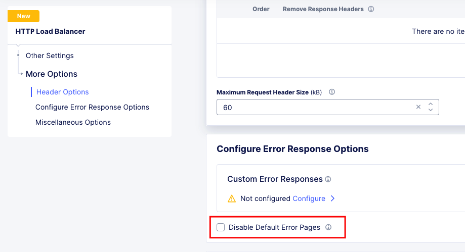


Response Error Codes
^^^^^^^^^^^^^^^^^^^^

+-----------------+---------------------------------------------------+--------------------------------------------------------------------------------------------------------+
|  Response Code  | Error Message                                     | Description                                                                                            |
+=================+===================================================+========================================================================================================+
|     **403**     | **csrf_origin_mismatch**                          | | If CSRF is enabled we compare the value of origin header against a list of allowed domains. If       |
|                 |                                                   | | origin is not there WAF blocks the request. Check how the POST or PUT requests are being sent.       |
|                 |                                                   |                                                                                                        |
|                 |                                                   | * Is the Origin or Referer header set? Else a CSRF violation would be set.                             |
+-----------------+---------------------------------------------------+--------------------------------------------------------------------------------------------------------+
|     **404**     | **route_not_found**                               | | XC did not find a route or domain that matches current config. It is possible that there is no       |
|                 |                                                   | | route match (misconfiguration).                                                                      |
|                 |                                                   |                                                                                                        |
|                 |                                                   | * SNI at Origin Server config is wrong.                                                                |
|                 |                                                   | * The request fails because authority does not route match.                                            |
|                 |                                                   | * There is no match for host header www.example.com (wildcard domains are allowed)                     |
|                 |                                                   | * There is no match condition in any of the route objects.                                             |
|                 |                                                   | * Request to a HTTP LB will be rejected (404) with a req_id if the incoming Host header:               |
|                 |                                                   |                                                                                                        |
|                 |                                                   |   * Does not match any of the values configured under Domains                                          |
|                 |                                                   |   * Does not match the CNAME value for the virtual host (ex:ves-io-<random-string>.ac.vh.volterra.us)  |
+-----------------+---------------------------------------------------+--------------------------------------------------------------------------------------------------------+
|     **408**     | **rsp_code_details=request_overall_timeout**      | Check if there is slow_ddos_mitigation with request_timeout configured.                                |
+-----------------+---------------------------------------------------+--------------------------------------------------------------------------------------------------------+
|     **503**     | **cluster_not_found**                             | | XC did not find an endpoint to send upstream.                                                        |
|                 |                                                   |                                                                                                        |
|                 |                                                   | * It is possible that there was no route match (misconfiguration)                                      |
|                 |                                                   | * If using a k8s service as upstream, its possible the service name is wrong.                          |
+-----------------+---------------------------------------------------+--------------------------------------------------------------------------------------------------------+
|     **503**     | **upstream_reset_before_response_started**        | | One common reason would be that the firewalls would not have allow listed Regional Edge public IPs,  |
|                 | **{connection}**                                  | | to reach upstream(s). https://docs.cloud.f5.com/docs/reference/network-cloud-ref.  Another common    |
|                 |                                                   | |                                                                                                      |
|                 |                                                   | | Another common reason is related to connection failure after X amount of seconds the connection      |
|                 |                                                   | | timeout. Try to increase the connection timeout at origin pool to a higher value to overcome this.   |
+-----------------+---------------------------------------------------+--------------------------------------------------------------------------------------------------------+
|     **503**     | **no_healthy_upstream**                           | | Health check on the origin pool has failed. Check health check config and the expected response      |
|                 |                                                   | | codes, as well as allowed IPs.                                                                       |
+-----------------+---------------------------------------------------+--------------------------------------------------------------------------------------------------------+
|     **503**     | **via_upstream**                                  | | The upstream server has generated this error code. Analysis has to be done on the endpoint. Analysis |
|                 |                                                   | | has to be done on the endpoint. Another recommendation in such cases is to take a pcap from the      |
|                 |                                                   | | client to origin server and see the details of the request.                                          |
+-----------------+---------------------------------------------------+--------------------------------------------------------------------------------------------------------+
|     **503**     | **remote_reset**                                  | | Can happen if the server does not correctly work with the http(1.1 or 2). Curl to the endpoint       |
|                 |                                                   | | directly and see what http version works for the request and configure accordingly.                  |
+-----------------+---------------------------------------------------+--------------------------------------------------------------------------------------------------------+
|     **503**     | | **upstream_reset_before_response_started**      | | If any TLS error is seen like this, it indicates a TLS handshake failure.                            |
|                 | | **{connection_failure, TLS_error,**             |                                                                                                        |
|                 | | **OPENSSL_internal, Connection_reset_by_peer}** |                                                                                                        |
+-----------------+---------------------------------------------------+--------------------------------------------------------------------------------------------------------+
|     **503**     | | **upstream_reset_before_response_started**      | | Check if SSL negotiation is working with the endpoint by doing a curl to the endpoint via https      |
|                 | | **{connection_failure, TLS_error,**             | | directly, and ensure the proper version protocol is selected.                                        |
|                 | | **OPENSSL_internal:WRONG_VERSION_NUMBER}**      |                                                                                                        |
+-----------------+---------------------------------------------------+--------------------------------------------------------------------------------------------------------+
|     **503**     | | **upstream_reset_before_response_started**      | | The certificate offered by the server was validated and that validation failed.                      |
|                 | | **{connection_failure, TLS_error,**             |                                                                                                        |
|                 | | **OPENSSL_internal::CERTIFICATE_VERIFY_FAILED}**| * In the Origin pool TLS config, skip the verification.                                                |
|                 | |                                                 | * In the Origin pool TLS config, Use a custom CA list.                                                 |
+-----------------+---------------------------------------------------+--------------------------------------------------------------------------------------------------------+
|     **503**     | | **upstream_reset_before_response_started**      | | The upstream server is closing the connection.  It is possible that the upstream server :            |
|                 | | **{connection termination}**                    |                                                                                                        |
|                 | | **OPENSSL_internal::CERTIFICATE_VERIFY_FAILED}**| * Is overloaded by the requests and unable to handle it. Check response time value.                    |
|                 |                                                   | * Has a http idle timeout can be lesser than the idle-timeout on the origin-pool.                      |
|                 |                                                   |                                                                                                        |
|                 |                                                   | | The origin-pool idle-timeout must be configured to be less than that on the server.                  |
+-----------------+---------------------------------------------------+--------------------------------------------------------------------------------------------------------+
|     **503**     | | **upstream_reset_before_response_started**      | | Check if the http response headers from the origin-server have any invalid field names. Query the    |
|                 | | **{protocol_error}**                            | | the origin-server directly via curl or something equivalent. Usually indicates that XC is seeing an  |
|                 |                                                   | | error in one of the http-headers of the response from the server. We would need to see the http      |
|                 |                                                   | | headers that the origin-server is responding with to identify the issue.                             |
|                 |                                                   | |                                                                                                      |
|                 |                                                   | | In one of the scenarios, it was seen that the origin-server may have a total of more than 100 headers|
|                 |                                                   | | (mostly duplicate headers), which XC will treat as failure parsing the response.                     |
+-----------------+---------------------------------------------------+--------------------------------------------------------------------------------------------------------+
|     **503**     | | **upstream_reset_before_response_started**      | | No TCP SYN-ACKs seen for the TCP connection attempts to the endpoints.                               |
|                 | | **{connection_failure,**                        | | The time_to_last_downstream_tx_byte would usually show some x seconds, and the other *time_to_last_* |
|                 | | **delayed_connect_error:_111}**                 | | fields would be 0 in this case.                                                                      |
+-----------------+---------------------------------------------------+--------------------------------------------------------------------------------------------------------+
|     **503**     | | **upstream_reset_before_response_started**      | | This error is due to server closing the connection while connection pool is still active.            |
|                 | | **{connection_termination}**                    |                                                                                                        |
|                 |                                                   | * Match the connection idle timeout between XC origin pool and Server.                                 |
|                 |                                                   | * Keep XC origin pool idle timeout a few seconds lesser than than the server timeout                   |
|                 |                                                   | * Apply retry policy for 5xx error.                                                                    |
|                 |                                                   |                                                                                                        |
|                 |                                                   | | Packet capture if the issue still persists after applying above config changes.                      |
+-----------------+---------------------------------------------------+--------------------------------------------------------------------------------------------------------+
|     **503**     | | **upstream_reset_before_response_started**      | | This error currently requires a Packet Capture (tcpdump) to troubleshoot.                            |
|                 | | **{remote_refused_stream_reset}**               |                                                                                                        |
+-----------------+---------------------------------------------------+--------------------------------------------------------------------------------------------------------+
|     **504**     | | **stream_idle_timeout**                         | |  Origin server took more than the idle timeout configured to respond to the request. Increase the    |
|                 | |                                                 | |  idle timeout on the HTTP LB.                                                                        |
+-----------------+---------------------------------------------------+--------------------------------------------------------------------------------------------------------+
|     **504**     | | **stream_idle_timeout**                         | |  Origin server took more time than the timeout configured on the route in the Loadbalancer. Increase |
|                 | |                                                 | |  the timeout in the miscellaneous options of the route (default 30 seconds)                          |
+-----------------+---------------------------------------------------+--------------------------------------------------------------------------------------------------------+
|     **504**     | .. note:: Note that this response code may be seen due to TCP Connection timeout towards the upstream. It will happen in cases where the route timeout has |
|                 |           a lower value than connection timeout configured on the upstream origin pool.                                                                    |
+-----------------+------------------------------------------------------------------------------------------------------------------------------------------------------------+

Other Errors
^^^^^^^^^^^^

* Refused to execute script from 'https://exampl.com/Errors/GlobalExceptionHandler.aspx?aspxerrorpath=/WebResource.axd' because its MIME type ('text/html') is not executable, and strict MIME type checking is enabled. 

  https://my.f5.com/manage/s/article/K98868401 

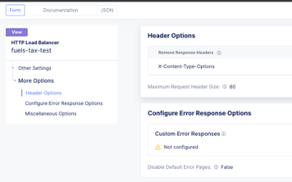

Important Request Log Fields
^^^^^^^^^^^^^^^^^^^^^^^^^^^^

* **time_to_last_downstream_tx_byte**: Interval between the first downstream byte received and the last downstream byte sent.		
* **time_to_first_downstream_tx_byte**: Interval between the first downstream byte received and the first downstream byte sent.		
* **time_to_last_upstream_rx_byte**: Interval between the first downstream byte received and the last upstream byte received		
* **time_to_first_upstream_rx_byte**: Interval between the first downstream byte received and the first upstream byte received ( time it takes to start receiving a response)		
* **time_to_first_upstream_tx_byte**: Interval between the first downstream byte received and the first upstream byte sent		
* **time_to_last_upstream_tx_byte**: Interval between the first downstream byte received and the last upstream byte sent		
* **duration_with_data_tx_delay = time_to_last_downstream_tx_byte - time_to_first_upstream_tx_byte**: Basically indicates how much "time" its inside XC LB to do processing of the request/response ( like eg WAF , API detection , service policy , Bot detection etc if enabled ) + time upstream spent to process		
* **duration_with_no_data_tx_delay = time_to_first_downstream_tx_byte - time_to_first_upstream_tx_byte**: Similar to duration_with_data_tx_delay , except that reference is taken from the moment first byte is sent to client		

Terminology
-----------

* AWAF: Advanced Web Application Firewall

* Downstream: Client Side Connection (Source)

* SNAT: Source Network Address Translation

* Upstream: Server Side Connection (Origin)

* WAAP: Web Application & API Protection

* XC: F5 Distributed Cloud
