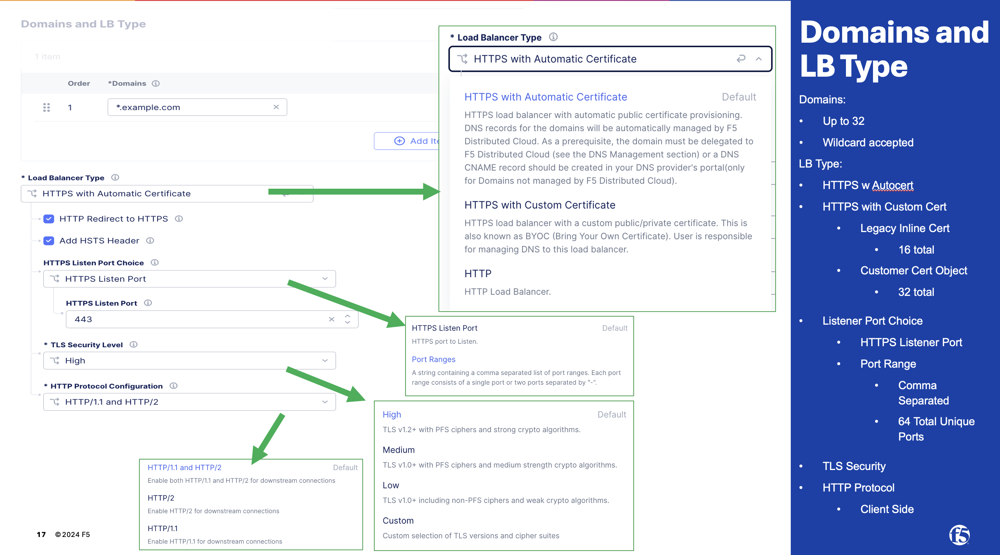
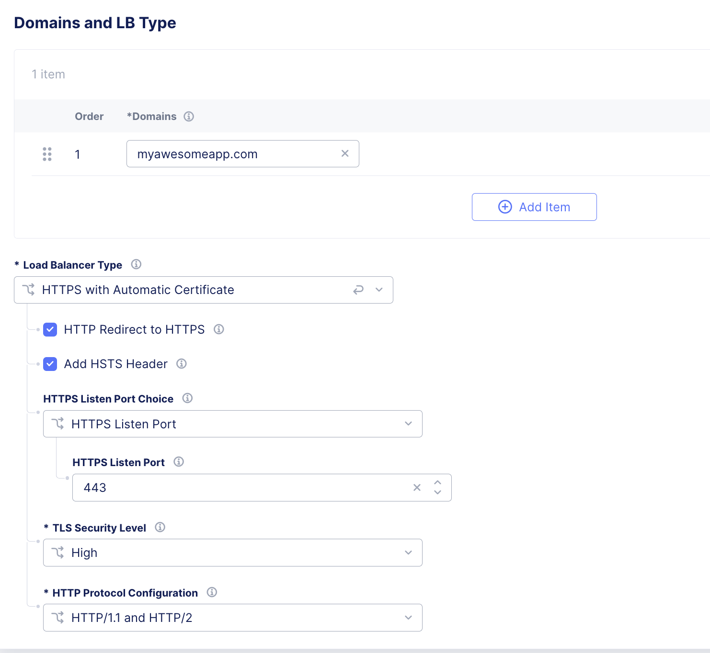

.. meta::
   :description: F5 Distributed Cloud HTTP LB Field Recommended Settings
   :keywords: F5, Distributed Cloud, HTTP-LB, Settings
   :category: Field-Sourced-Content
   :sub-category: how-to
   :author: Steven Iannetta

.. _http_lb_field_recommended_settings:

Distributed Cloud HTTP-LB Field Recommended Settings
=====================================================================================

Guide is a Work In Progress
--------------------------

Introduction
--------------------------

This document provides guidance and recommendations for establishing a foundational HTTP Load Balancer (HTTP-LB) configuration.  The suggested settings are based on
practices gathered from field teams with extensive experience deploying HTTP-LBs and related components within customer environments for PoV purposes or to establish a baseline deployment model.
While this is not an exhaustive configuration guide this document serves as a starting point to support customers in their Distributed Cloud journey and inital deployments of HTTP-LB.
Customers are encouraged to customize and adapt these recommendations to meet their specific requirements and deployment scenarios.

Covered Topics:
--------------------------

   * Domains and Certificate
   * Origin Pool Settings
   * Health Checks
   * Routes
   * Web Application Firewall
   * DoS Settings
   * Common Security Controls
   * Other Settings

Domains and Certificates:
---------------------------
Below is a screen shot of the options for an "HTTP LB Domains and LB Type" Object.

Options and Settings for Domains:
   * Can have up to 32 Domains Per HTTP-LB
   * Wildcard prefix is supported (example in picture above)
   * SAN Certificates are supported
   * Auto Certificate utilizes Let's Encrypt for a Primary Domain Delegated to Distributed Cloud DNS.  There is an option for Auto Certificate with user managed DNS.  Customer needs to buildout the challenge record manually in their DNS or build any automation they prefer.

Typical PoV Settings:

Origin Pool:
---------------------------

Origin Pool is a mechanism to configure a set of endpoints grouped together into a resource pool used in the load balancer configuration.  The main functions that 
an origin pool is responsible for is the following:

   * Discovery of Endpoints
   * Load Balancing Between Endpoints
   * Health Checks for Endpoints
   * TLS Capabilities to Endpoints

* `F5 XC Creating Origin Pool <https://docs.cloud.f5.com/docs-v2/multi-cloud-app-connect/how-to/create-manage-origin-pools>`_.

