.. title:: Configuring DNS for XC Load Balancer

.. meta::
   :description: Configuring DNS Options for XC LB Services
   :keywords: F5, Distributed Cloud, XC, DNS, LB, AutoCert
   :category: Field-Sourced-Content
   :sub-category: how-to
   :author: Brad Scherer
   
.. _lb-dns-config:

Introduction
================================

This document outlines the three primary methods customers can use to configure DNS settings to point to our cloud load balancers. 
It also highlights which options provide support for automatic certificate management. 
Understanding these methods is critical for ensuring seamless traffic routing and securing connections with managed certificates, enabling efficient and secure load balancing in XC.

Configuring DNS Delegation to XC
================================

There are 3 options for getting clients resolved appropriately to the XC Cloud Load Balancer.

1. "A" record Modification (BYOC - bring your own cert)
2. CNAME Delegation (BYOC)
3. Subdomain Delegation (Auto Certificate supported)

In all three examples below, Godaddy is playing the role of both Name Registrar and Primary DNS.

################################################################################

"A" Record Modification Example
-------------------------------

"A" record modification is quick and straightforward to configure. Similar to setting a host file on your local system.

.. note:: Auto Certificate management not supported in this configuration. BYOC.

Overview
~~~~~~~~

- Godaddy DNS is authoritative for myfselab.com.
- An "A" record exists in Godaddy DNS for site1.myfselab.com.

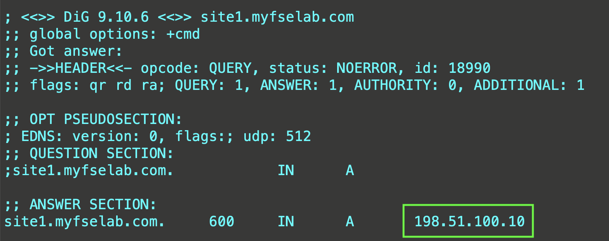

1. Create an XC-LB. Example domain is: **"site1.myfselab.com"**
2. Retrieve XC public IP from LB JSON (get_spec->DNS Info->IP Address)
3. Modify "A" record in GoDaddy to point to XC IP
4. Verify

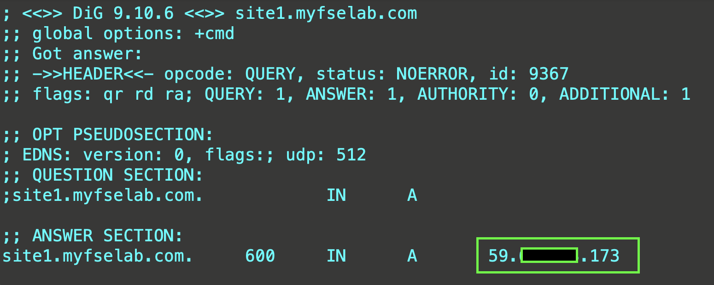

################################################################################

CNAME Delegation Example
------------------------

Overview
~~~~~~~~

- Godaddy DNS is authoritative for myfselab.com.
- An "A" record exists in Godaddy DNS for site1.myfselab.com.

.. note:: Auto Certificate management not supported in this configuration. BYOC.

1. Create an XC-LB.
2. Retrieve XC LB CNAME.

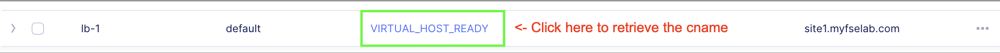

3. Copy the CNAME.

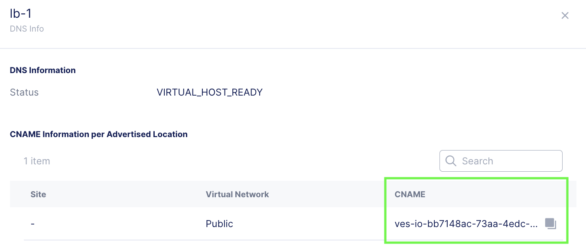

4. In Godaddy, delete the existing "A" record for **site1.example.com** and create a CNAME record pointing site1 to the XC CNAME.

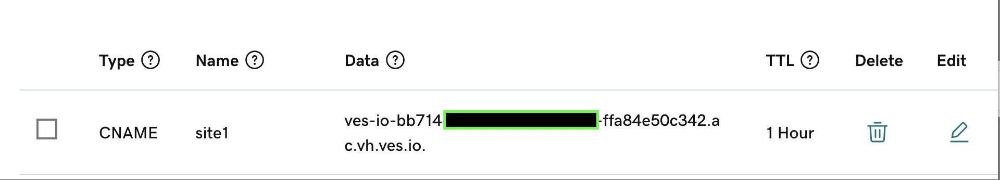

5. Verify.

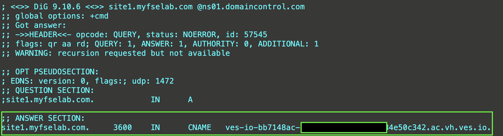

################################################################################

Subdomain Delegation Example
----------------------------

Overview
~~~~~~~~

- Godaddy DNS is authoritative for myfselab.com.
- No records exist in Godaddy DNS for site1.myfselab.com.

.. note:: Auto Certificate supported in this configuration.

1. Add subdomain to be delegated **site1.myfselab.com** as a primary domain in XC DNS.

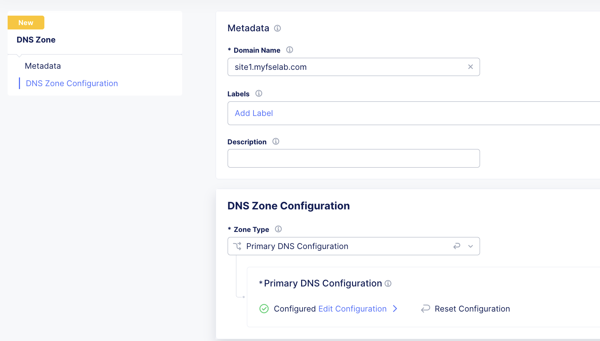

- Make sure to check the box for: "Allow Application Load Balancer Managed Records" under the Primary DNS Configuration options.

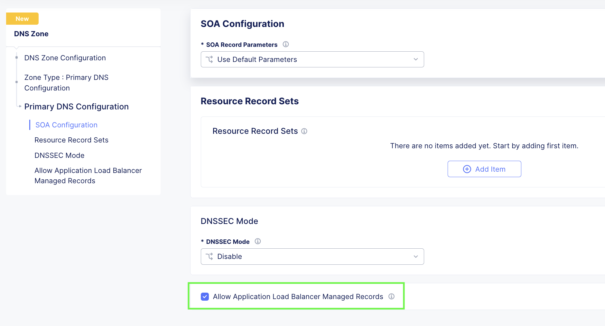

2. In GoDaddy, add F5 Cloud DNS Server NS records with a delegation to **site1**.

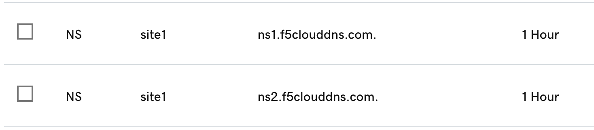

3. Create LB object with auto-cert enabled. EX: site1.mytest.myfselab.us.

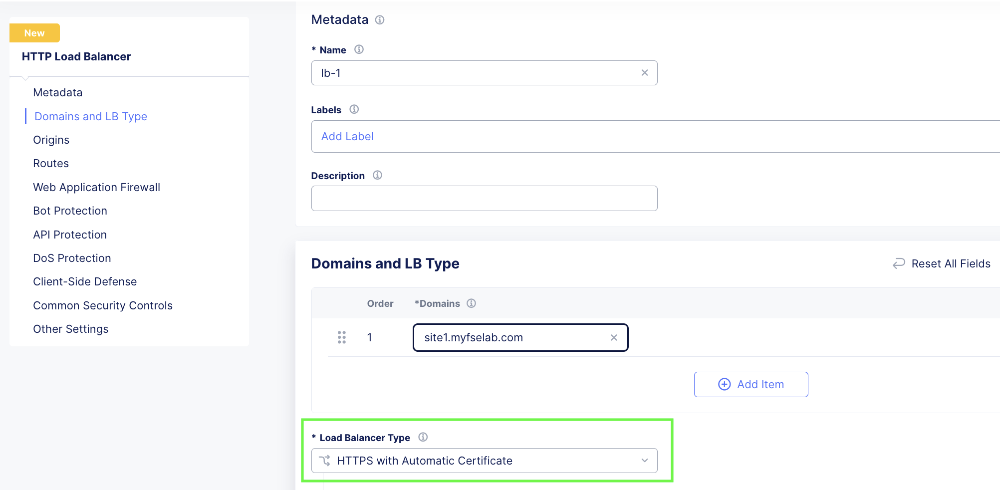

4. Verify - The cert generation process can take a few minutes. You will see it in a pending state. Click on the "i" for more info.

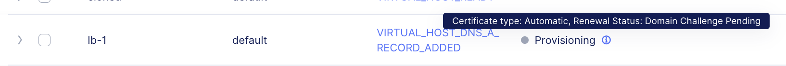

5. Success.

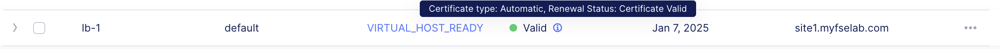
